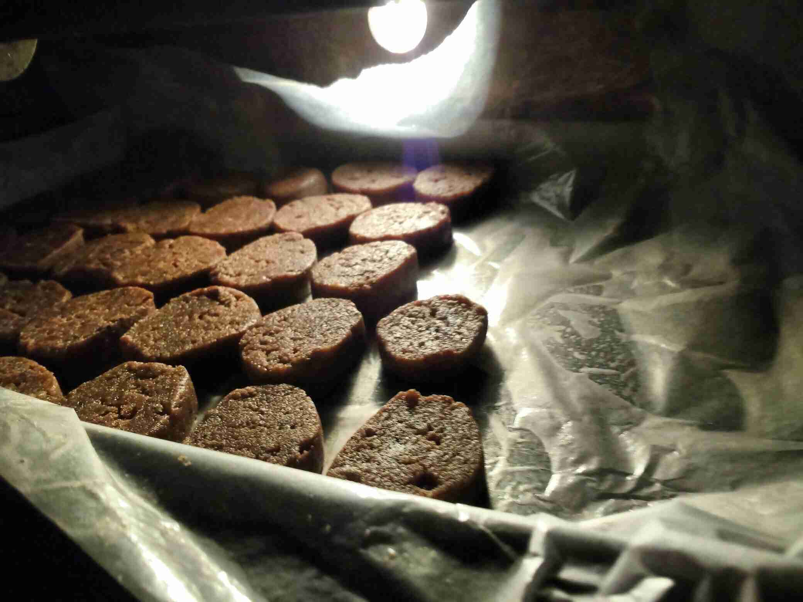

<!--
SPDX-FileCopyrightText: 2020-2022 Robin Vobruba <hoijui.quaero@gmail.com>

SPDX-License-Identifier: CC0-1.0
-->

## Ingredients

dry:

- 1000 g jowar/sorghum flour - sieved\
  [{ width=24% }](assets/german-cookies-2019-12-24/00_flour.jpg)
- 500 g jaggery (powder)\
  [{ width=24% }](assets/german-cookies-2019-12-24/07_jaggery_raw.jpg)
  [{ width=24% }](assets/german-cookies-2019-12-24/08_jaggery_powder.jpg)
- 200 g ground (sweet) almonds\
  [{ width=24% }](assets/german-cookies-2019-12-24/02_almonds.jpg)
- 30+ g grated nutmeg
- 30+ g cinnamon powder\
  [{ width=24% }](assets/german-cookies-2019-12-24/03_spices_raw.jpg)
- 10+ g cloves powder
- (optional) a bit of ginger
- (optional) a bit fenugreek seed powder
- (optional) a bit galangal (similar to ginger, good for the heart)
- (optional) a bit backing powder
- (optional) 2 hands full of dried fruits (e.g. cranberries), chopped
- (optional) ¼ TS salt
- (optional) peel of 1 lemon
- (optional) peel of 1 orange

fatty:

- 300 g coconut oil\
  [{ width=24% }](assets/german-cookies-2019-12-24/01_coconutOil.jpg)
  [{ width=24% }](assets/german-cookies-2019-12-24/06_coconutOil_raw.jpg)

watery:

- 6 tea-spoons of sabza (Indian version of Quinoa)\
  [{ width=24% }](assets/german-cookies-2019-12-24/04_sabza_dry.jpg)
- (optional) juice of 1 lemon

topping:

- (optional) 200 g dark chocolate -- grated

## Instructions

> **NOTE** We add the fat and knead before we add the watery parts,
> so the fat coats the flour, and thus prevents the water
> from making the flour form clumps.

1. Soak the sabza in warm water for 5min, keep separate for now\
   [{ width=24% }](assets/german-cookies-2019-12-24/05_sabza_soaked.jpg)
1. Process the jaggery(-powder) together with (some of) the flour in a blender\
  [{ width=24% }](assets/german-cookies-2019-12-24/09_before_blending_jaggery.jpg)
  [{ width=24% }](assets/german-cookies-2019-12-24/11_flour_and_jaggery_before_blending.jpg)
  [{ width=24% }](assets/german-cookies-2019-12-24/12_flour_and_jaggery_after_blending.jpg)
1. Put all the dry ingredients into a bowl and mix them\
   (optimally the more voluminous on the bottom)\
  [{ width=24% }](assets/german-cookies-2019-12-24/10_dry_without_jaggery.jpg)
  [{ width=24% }](assets/german-cookies-2019-12-24/13_kneading_the_dough.jpg)
  [{ width=24% }](assets/german-cookies-2019-12-24/14_kneaded_dough_before_watery.jpg)
1. Add the fatty ingredients and knead the shortcrust well
1. Add the watery ingredients and knead again
1. Form rolls\
  [{ width=24% }](assets/german-cookies-2019-12-24/15_rolls.jpg)
1. Roll them into backing/butter paper, and keep them in the fridge for at least 30min\
  [{ width=24% }](assets/german-cookies-2019-12-24/16_rolls_in_paper.jpg)
1. Preheat the oven to 180C
1. Cut of about 1cm - 1.5cm thick rolls\
  [{ width=24% }](assets/german-cookies-2019-12-24/17_cutting_rolls.jpg)
  [{ width=24% }](assets/german-cookies-2019-12-24/18_cut_rolls.jpg)
  [{ width=24% }](assets/german-cookies-2019-12-24/19_ready_to_be_baked.jpg)
1. Bake without circulating air, as for your liking:
	- 7min - 10min : This rather dries then bakes the cookies, meaning they will be bright and a bit soft
	- 15min : they will be a bit brown\
  [{ width=24% }](assets/german-cookies-2019-12-24/20_solarCooker_5.jpg)
  [{ width=24% }](assets/german-cookies-2019-12-24/21_baking_in_oven.jpg)
  [{ width=24% }](assets/german-cookies-2019-12-24/22_baked_too_much.jpg)

## Consumption

Adults can eat 4 to 5 per day, not more!\
Children 3, otherwise they get too smart.
