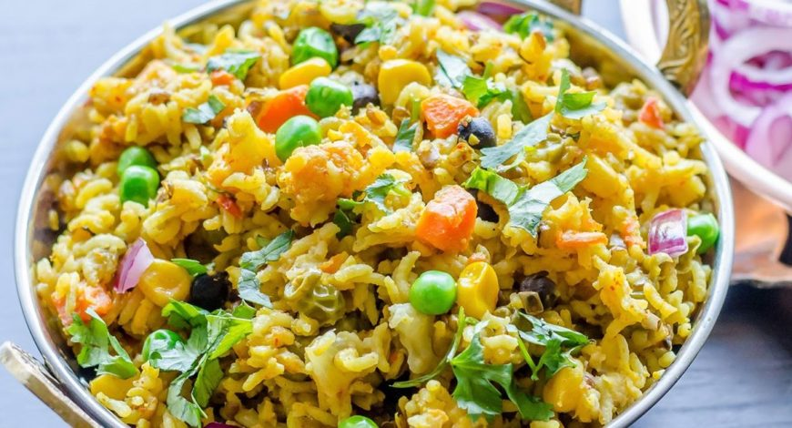

<!--
SPDX-FileCopyrightText: 2020 Shammi Nanda <shamminanda@gmail.com>
SPDX-FileCopyrightText: 2020-2022 Robin Vobruba <hoijui.quaero@gmail.com>

SPDX-License-Identifier: CC0-1.0
-->

A very popular and nutritious dish, which can be a whole meal on its own.

At AhimsaGram, we used to use black chickpeas as the daal (they are small).

### Ingredients

main:

- 200 g brown rice
- 200 g daal (any kind, e.g. black chickpeas)
- onions
- coriander leafs
- cumin seeds
- coriander seeds
- turmeric
- ginger
- peanuts, roasted
- (optional) oil
- (optional) pinch of [hing (asafoetida)](https://en.wikipedia.org/wiki/Asafoetida)
- (optional) chili (red or green)
- salt

vegetables:

- cauliflower
- capsicum
- fresh green beans
- carrots
- potatoes
- ...

### Instructions

main:

1. Soak the rice and daal together for at least half an hour

---

1. Cut the onions into long slices
1. Chop the ginger and turmeric into small pieces if fresh
1. Roast the cumin in a pan (optionally with oil)
1. (optional) Add and roast the (whole) red chilies
1. Add and roast the onions
1. Add and roast the ginger, turmeric and coriander seeds
1. (optional) Chop and add the green chilies
1. Add some tomatoes and cook it into a sauce, but not too much
   (we need it watery anyway at this point, and the tomatoes water is miner one,
   and so we want to keep that)
1. Add the rice and daal plus some water, and boil it for 40 - 60 min
1. (optional) Mix the hing with a bit of hot water and put it into the main pan
1. Chop and add the coriander-leafs

vegetables:

1. [Steam the vegetables separately](steamed-vegetables.md)
1. Put them in the main pan
1. Serve with salt and peanuts aside

> NOTE: You may make this dish watery or dry, but if it is dry,
>       you need something else to eat it with.
