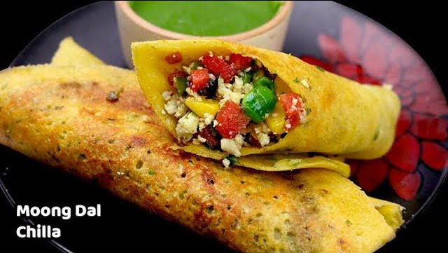

<!--
SPDX-FileCopyrightText: 2020 Shammi Nanda <shamminanda@gmail.com>
SPDX-FileCopyrightText: 2020-2022 Robin Vobruba <hoijui.quaero@gmail.com>

SPDX-License-Identifier: CC0-1.0
-->

## Ingredients

* 3 bowls of mung-daal (whole or broken, green small beans)
* 1 bowl of urag-daal (white-yellow lentils without peal) (broken)
* some peanut-oil

## Instructions

batter:

1. Soak the two daals separately for 2+h if possible.
   This creates at least a bit of fermentation.
   If it is very cold, you may want to put the batter into the sun,
   protected from the wind, and with a lid on it.
   No soda, sugar, baking-powder, baking-soda or inno is to be used!\
   Natural fermentation.
1. Blend the urag-daal into a very fine paste
1. blend the mung-daal a bit
1. add them together into one bowl

making the dosa:

1. Heat the flat iron pan
1. Put just a few drops of oil
1. Sprinkle with just a bit of water, and wipe with a clean cloth\
   (This will create a very thin layer of oil, just enough for the wrap to not stick to much,
   but still stick a bit)
1. Use a big spoon and put some of the batter into the middle of the pan
1. Slowly spread out the batter into a thin, round shape,
   using a single spiral movement of the spoon
1. Let it roast for a bit, and then put a lid on it,
   so the steam will also cook the upper side
1. Remove the lid, and try to loosen the dosa from the pan using a spade
1. Put some of the potato paste on top, spread it out, and let it heat up for some time
1. Add some [steamed vegetables](steamed-vegetables.md), and let them heat up
1. Move it to a plate, roll it up, and cut it into three pieces
1. Serve with [tamarind chutney](tamarind-chutney.md)

> NOTE: When putting the batter on the pan,
>       if it is fermented well, you will notice little holes forming.
>       This is good, as steam is escaping from them,
>       which cooks the whole batter,
>       in addition to the roasting of the batter on the bottom.

### History

Most of or dishes created by us, have some story, and so does this.

I was having symptoms of asthma, and contacted the [Health Awareness Center](http://www.internetindia.com/health/thac/).
They recommended to stop consuming grains, so I stopped consuming grains for one year.
During that time, I often felt like having a chapati, but couldn't.
Somehow, mung-daal wrap/chilla/dosa came to me.
Lyla -- through an Instagram post from Moonstar, who has an other community space in Chandigarh - then got the idea of filling the wrap with steamed vegetables.
And so it came, that for the next year, this was what I ate every day:
Mung-daal wrap with steamed vegetables and tahini or peanut-butter on top of it.
I can live off of that for every day, every meal, ever since.

There are dosa made of rice too, but rice is still a grain.
So if you want to move out of a grain-based diet,
this might be a very interesting way for you too.
It is a nice substitute for wheat or even millet chapatti as your staple, go-to food.
