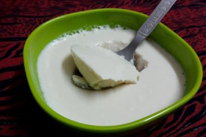

<!--
SPDX-FileCopyrightText: 2020 Shammi Nanda <shamminanda@gmail.com>
SPDX-FileCopyrightText: 2020-2022 Robin Vobruba <hoijui.quaero@gmail.com>

SPDX-License-Identifier: CC0-1.0
-->

It is like a very fresh yogurt.

See also [standard peanut curd](peanut-curd.md).

### Ingredients

- 2 cups of peanuts with peal
- 5 - 6 chili heads
- cucumber
- pomegranates seeds
- lemon
- mint
- salt
- cumin

### Instructions

1. Soak the peanuts over night
1. Blend them up with some water to create a paste
1. Add the chili heads
1. Boil the paste for a very short time only
1. Put it in a ceramic bowl and leave it over night
1. Take the chili heads out
1. Mix it
1. Add:
	- cucumber
	- lemon
	- mint
	- salt
	- cumin
1. Mix it
1. Put pomegranates seeds on top
