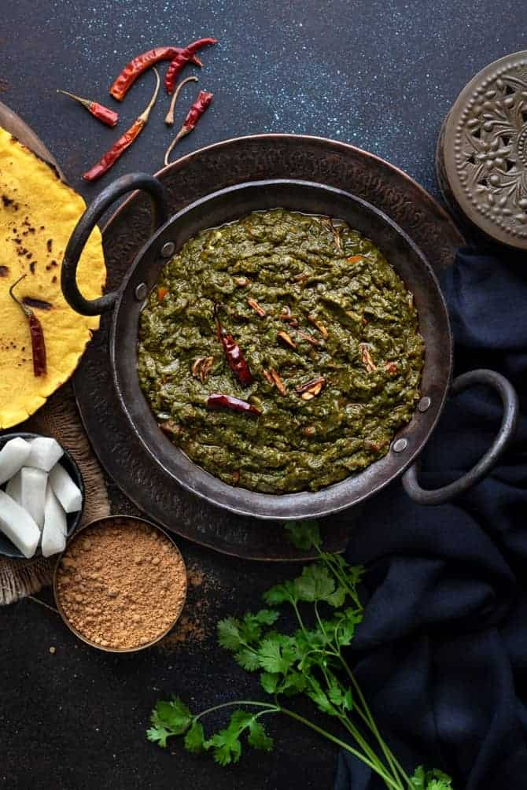

<!--
SPDX-FileCopyrightText: 2020 Shammi Nanda <shamminanda@gmail.com>
SPDX-FileCopyrightText: 2020-2022 Robin Vobruba <hoijui.quaero@gmail.com>

SPDX-License-Identifier: CC0-1.0
-->

Inspired b Lyla's mothers recipe.

### Ingredients

sag:

- 1 kg mustard greens
- 500 g spinach
- 250 g [bathua (melde)](https://en.wikipedia.org/wiki/Chenopodium_album)
- 250 g fenugreek
- 1 small green chili

thurka:

- onions

### Instructions

sag:

1. Take off the mustard leafs, chop them separately and wash them in a big(gish) pan,
   by taking the leafs out instead of removing the water,
   for to get rid of more earth and sand; do this 3 to 4 times
1. Peal the mustard stocks and chop them separately
1. Clean the spinach
1. Clean the fenugreek leafs
1. Clean the bathua
1. Boil all the leafs (without the stocks) with the chili;
   do not add any water in the end, only if necessary a tiny bit in the beginning;
   no water should be left
1. Cook the stocks separately
1. Mix the two things
1. Put it in the blender and just pulse a few times, or use a flat-round wooden whisk
   (not the one with teeth in it)

This can be kept in the refrigerator for a few days.

When using it, take a bit of the sag, and mix it with this thurka
(in a (volume) ratio of 2 to 1):

1. Roast some onions
1. Add green chili
1. Add [garam masala](garam-masala.md) (no turmeric or coriander)
2. Mix it with double the volume of the sag (see above)

This fits well with [makki roti](makki-roti.md).
