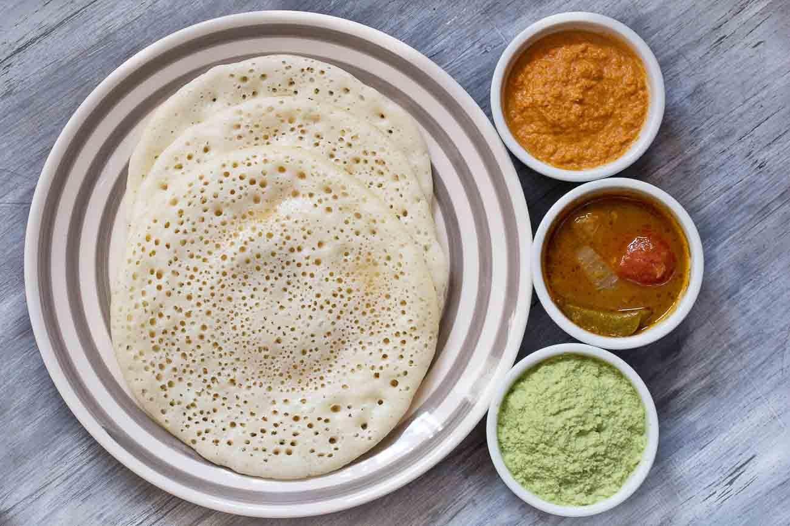

<!--
SPDX-FileCopyrightText: 2020 Shammi Nanda <shamminanda@gmail.com>
SPDX-FileCopyrightText: 2020-2022 Robin Vobruba <hoijui.quaero@gmail.com>

SPDX-License-Identifier: CC0-1.0
-->

These are chapati kind of dosas.

In Kerala -- where this dish comes from --
it is also called *weed dosa* ("dosa at home"),
as they often make them like this at home.

You follow the instructions for [mung-daal wrap](mung-daal-wrap.md),
but replace the mung-daal with brown or red rice.
