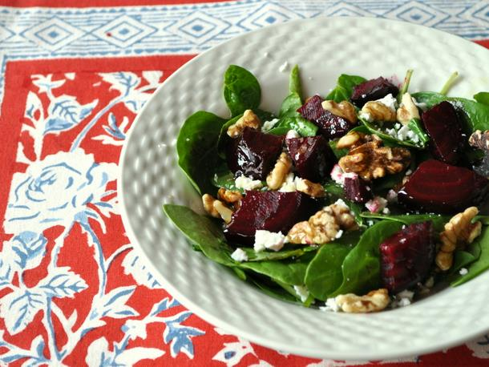

<!--
SPDX-FileCopyrightText: 2020 Shammi Nanda <shamminanda@gmail.com>
SPDX-FileCopyrightText: 2020-2022 Robin Vobruba <hoijui.quaero@gmail.com>

SPDX-License-Identifier: CC0-1.0
-->

very raw and natural!

As there is no salt, it can be used for several days.

It goes well as side dish to most any main-meal.

### Ingredients

- 500 g of some form of spinach
- 500 g beetroot
- 500 g carrots
- 500 g broccoli
- (optional) 300 g celery green
- ~10 cloves of garlic
- 5 small lemons or limes

### Instructions

1. grate (or cut into pieces of your preferred size) the beetroot and carrots
1. cut the broccoli into pieces suitable for the mouth, smaller for the stem
1. (optional) cut the celery green into pieces of your liking
1. add all the above into the salad bowl
1. juice the lemons and add the juice into the bowl
1. peal the garlic, chop it finely, and add it into the bowl
1. mix everything

> **NOTE** It tastes best when you let the garlic and lemon flavor "soak in"
>          for at least 30min before serving
