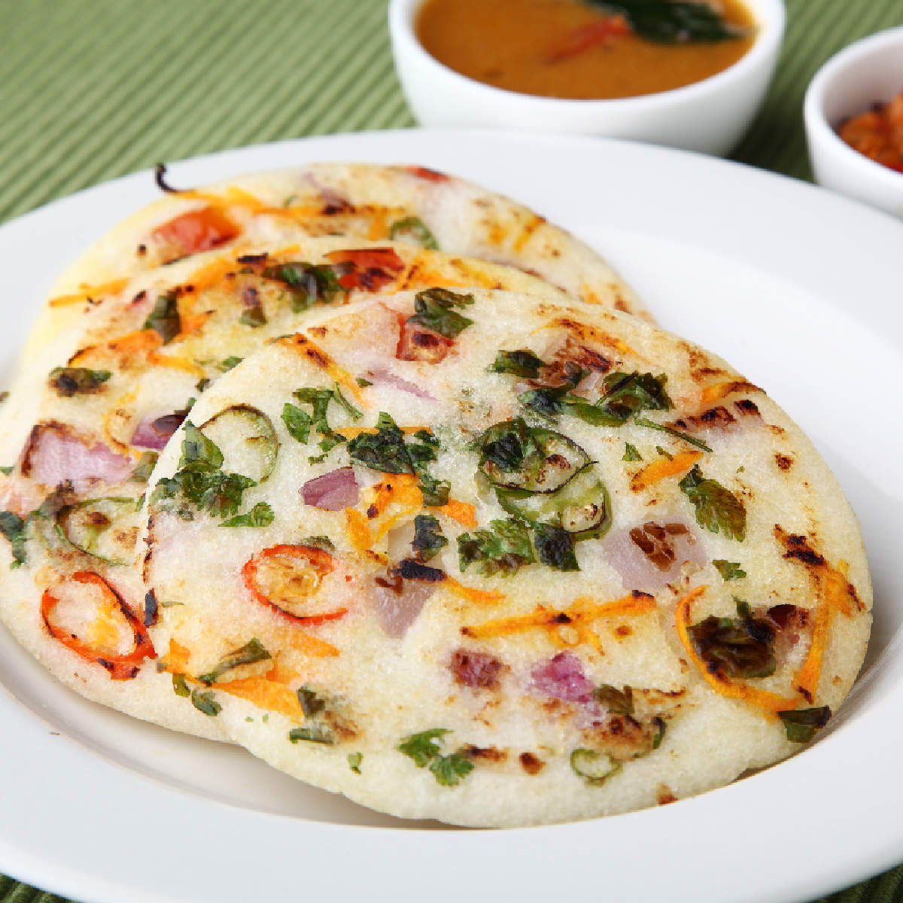

<!--
SPDX-FileCopyrightText: 2020 Shammi Nanda <shamminanda@gmail.com>
SPDX-FileCopyrightText: 2020-2022 Robin Vobruba <hoijui.quaero@gmail.com>

SPDX-License-Identifier: CC0-1.0
-->

Inspired by a dish at a restaurant called "Chutneys" in Hyderabad.

When serving, one would give three different small uttapas on a plate (for example onion, spinach, tomato).

Generally, it is very similar to making a [set dosa](set-dosa.md),
just smaller and thicker.

You then put very finely cut or grated, raw vegetables on it, for example:

- capsicum and cabbage
- beetroot
- grated coconut
- grated coconut with vegetables
- onions
- tomatoes, probably it would be good to remove the liquid parts, and only use the meaty part, and most likely it needs a bit more oil on top
- spinach (or other greens)

Before turning around, it might need a bit of oil on top to not stick.

Make sure to put a lid on it after you put the vegetables,
so they also get steamed a bit.
